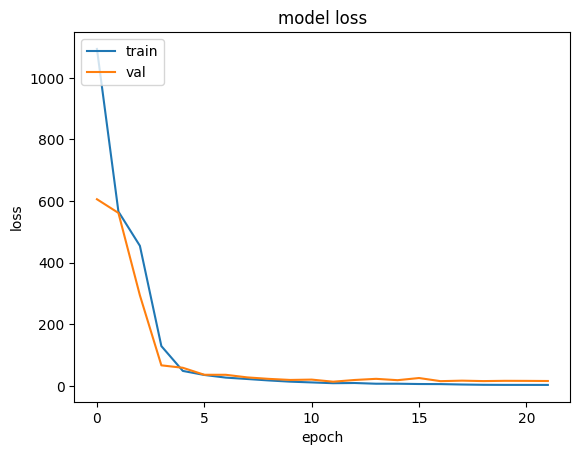

# Soft Tissue Deformation Analysis Starter Project

This repository serves as an accessible starting point for understanding and solving deformation analysis problems, inspired by advanced methodologies like **StrainNet**. 

The project begins with a simplified **"blob detection" task**, where the goal is to track the **relative positions of particles**—an essential concept in deformation mechanics. This foundational approach bridges the gap between basic spatial analysis and the complexities of real-world soft tissue deformation.

## Why Blob Detection?

### Blob detection provides:
- **Controlled Learning Environment**  
  A simplified yet effective way to simulate deformation scenarios.

- **Core Mechanics of Deformation**  
  By identifying and tracking the **relative positions of particles (blobs)**, we mimic the core principles of strain analysis in soft tissues.

- **Error Quantification**  
  A hands-on way to develop skills in measuring and interpreting positional differences.

This project emphasizes understanding particle relationships in deformation and positions itself as a solid foundation for progressing into advanced deformation mechanics.

# **2-Blob and 3-Blob Detection Models**

This section explains the 2-blob and 3-blob detection models used in this project to build foundational knowledge for deformation mechanics analysis.

---

## **2-Blob Detection Model**
The **2-blob model** involves generating images with two distinct points (blobs). The objective is to track their positions and analyze their relative displacements.  

### **Key Features**
- **Two Points (Blobs):**
  - **Point 1:** Represented by a specific color (e.g., red).  
  - **Point 2:** Represented by another distinct color (e.g., blue).  

- **Relative Position Analysis:**
  - Measure the pixel coordinates of the blobs.  
  - Analyze positional differences to simulate deformation.

- **Simplified Error Quantification:**
  - Compute both absolute and relative errors between predicted and actual positions.

### **Objective**
- Introduce the basic workflow for blob detection.  
- Develop skills in relative position analysis and error quantification.  

---

## **3-Blob Detection Model**
The **3-blob model** extends the 2-blob detection by adding a third point (blob), making the task more complex and realistic.

### **Key Features**
- **Three Points (Blobs):**
  - **Point 1:** Represented by a specific color (e.g., red).  
  - **Point 2:** Represented by another color (e.g., blue).  
  - **Point 3:** Represented by a third distinct color (e.g., green).  

- **Triangular Relationship:**
  - Analyze spatial relationships that form a triangular configuration.  
  - Study deformation through changes in angles and distances.

- **Increased Complexity:**
  - Challenges in differentiating between blobs.  
  - Advanced error analysis and deformation simulation.

### **Objective**
- Simulate deformation scenarios involving multiple reference points.  
- Provide insights into more complex deformation patterns seen in real-world applications.

---

## **Why Progression from 2 to 3 Blobs?**
- **Incremental Learning:**
  - Start with a simple 2-blob model for ease of understanding.  
  - Transition to 3-blob detection for handling complexity.  

- **Realistic Scenarios:**
  - The 3-blob model mimics real-world deformation patterns with multiple elements interacting.  

- **Foundation for Advanced Analysis:**
  - Prepares for dense deformation fields as encountered in soft tissue mechanics.

By progressing from 2-blob to 3-blob detection, this project lays the groundwork for advanced deformation analysis techniques, such as tracking hundreds of particles in real-world scenarios.

---

# **Data Generation for Blob Detection Models**

## **Overview**
Data generation is a critical step for building the foundation of blob detection models. It involves creating synthetic images with labeled points (blobs) to simulate deformation scenarios.

---

### **1. Synthetic Image Creation**
- **2-Blob Model:**
  - Images are generated with two distinct blobs.
  - Each blob is assigned a unique color for easy identification.
  
- **3-Blob Model:**
  - Images contain three distinct blobs, with each having a unique color.
  
- The blob sizes, colors, and placements are adjustable to suit specific training requirements.

---

### **2. Randomized Blob Placement**
- Blobs are placed at random positions within the defined image boundaries.
- This ensures diversity in the dataset, making the model robust to various spatial arrangements.

---

### **3. Label Creation**
- Labels include the precise pixel coordinates of each blob.
- Format: For a 2-blob model, the label includes coordinates for two blobs (e.g., `Point1_X, Point1_Y, Point2_X, Point2_Y`). For a 3-blob model, three sets of coordinates are provided.

---

# **Data Preprocessing for Blob Detection Models**

## **Overview**
Preprocessing ensures the dataset is clean and structured for effective model training. It involves standardizing image dimensions, normalizing pixel values, and organizing labels.

---

### **1. Image Standardization**
- Resize all images to a consistent size (e.g., 100x100 pixels).
- This ensures uniformity across the dataset.

---

### **2. Label Normalization**
- Normalize blob coordinates to a range of `[0, 1]` based on the image dimensions.
- This facilitates model learning and generalization.

---

### **3. Data Splitting**
- Split the dataset into training, validation, and testing subsets (e.g., 70:15:15 ratio).
- Ensure the split maintains diversity in blob placements.

---

# **Model Training for Blob Detection**

## **Overview**
The training phase uses the preprocessed data to build a neural network capable of predicting blob positions from images.

---

### **1. Model Architecture**
- Use a convolutional neural network (CNN) to extract spatial features from images.
- Output layer size corresponds to the number of coordinates to predict:
  - **2-Blob Model:** 4 outputs (2 blobs × 2 coordinates each).
  - **3-Blob Model:** 6 outputs (3 blobs × 2 coordinates each).

---

### **2. Training Configuration**
- **Loss Function:** Mean Squared Error (MSE) to minimize coordinate prediction errors.
- **Optimizer:** Adam optimizer for efficient convergence.
- **Metrics:** Track accuracy in predicting blob coordinates and evaluate overall model performance.

---

### **3. Iterative Training**
- Train the model on the training set while monitoring performance on the validation set.
- Adjust hyperparameters (e.g., learning rate, batch size) to optimize results.

---

# **Model Training Progress and Performance**

This section showcases the training progress and performance for both the 2-Blob and 3-Blob detection models. The training loss curves and the final images from the last 15 epochs are provided to illustrate how the models evolve over time.

---

## **Training Loss Curves**

### **2-Blob Model Loss vs. Epochs**

- **Description:**
  - The curve shows the loss reduction over epochs during training for the 2-Blob detection model.
  - The goal is to observe a steady decline in the loss, indicating that the model is learning and improving over time.
  - The graph helps visualize the effectiveness of the optimizer and the model's convergence behavior.

### **3-Blob Model Loss vs. Epochs**

- **Description:**
  - This graph represents the loss reduction across epochs during training for the 3-Blob detection model.
  - Similar to the 2-Blob model, the curve helps evaluate how well the model is learning, showing improvements as the loss decreases over time.

---

## **Training Images from Last 15 Epochs**

### **2-Blob Model - Final Training Image**

- **Description:**
  - This image represents the model's predictions after training for 15 epochs.
  - Last 15 training epoch , to show that the training hasn't plateaued , but close to plateauing.

### **3-Blob Model - Final Training Image**

- **Description:**
  - This image represents the model's predictions after training for 15 epochs for the 3-Blob detection task.
  - Last 15 training epoch , to show that the training hasn't plateaued , but close to plateauing.

---

These images demonstrate how the models' predictions improve as the training progresses and help evaluate the model's effectiveness in both blob detection tasks.

---

# **Predictions and Error Analysis**

This section presents images showing the model's predicted blob locations along with the error in the prediction. The error is calculated as the absolute difference between the predicted and actual coordinates, normalized by the actual value to express it as a relative error percentage.

---

## **Predicted Locations and Error for 2-Blob Model**

### **2-Blob Model Prediction Image**

- **Description:**
  - The image above displays the predicted blob locations for the 2-Blob model.
  - The predicted points are marked on the image (e.g., in a different color or as distinct markers).
  - The actual blob positions are given as labels in the dataset, while the predicted positions are derived from the model's output.

---

## **Predicted Locations and Error for 3-Blob Model**

### **3-Blob Model Prediction Image**

- **Description:**
  - The image above shows the predicted locations of all three blobs for the 3-Blob model.
  - As in the 2-Blob case, the predicted blob positions are compared with the actual values from the dataset, and the error is calculated for each coordinate.

---

## **Error Calculation Formula:**

The error for each predicted coordinate is calculated using the following formula:

$$
\text{Error} = \frac{| \text{Predicted Value} - \text{Actual Value} |}{\text{Actual Value}} \times 100
$$

This formula calculates the absolute difference between the predicted and actual coordinates and normalizes it by the actual value, expressed as a percentage.

---

### **Note on Error Magnitude:**
- The error might appear high, but it is important to consider that the coordinates of the blobs are typically small values. Therefore, even small absolute differences between predicted and actual points can lead to relatively large error percentages.

These prediction images, alongside the error analysis, allow us to assess the model’s performance in terms of detecting the exact positions of the blobs. The error analysis also helps to understand the sensitivity of the model's predictions, especially when dealing with small coordinate values.

