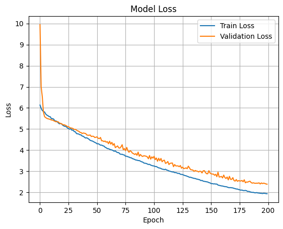
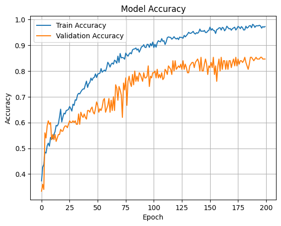
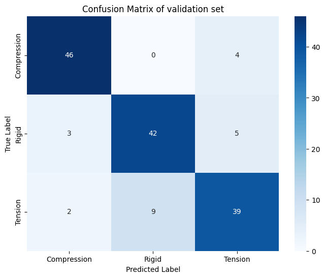

#  StrainNet: 3-Class CNN Classifier for Compression–Rigid–Tension

StrainNet is a Convolutional Neural Network (CNN) designed to classify strain images into three mechanical categories: **Compression**, **Rigid**, and **Tension**. It is built with TensorFlow/Keras and optimized for moderate complexity and robust regularization.

---

##  Dataset and Input Format

- Input Shape: `384 × 192 × 1` (grayscale strain maps)
- Number of Classes: 3
- Training & validation data were split stratified to ensure class balance.

---

##  Model Architecture

A 4-layer convolutional network with progressive depth and heavy regularization:

| Layer Type       | Filters/Units | Kernel Size | Pool Size | Notes                        |
|------------------|---------------|-------------|-----------|------------------------------|
| Conv2D + BN + LReLU | 32         | 4×4         | 3×3       | L2 regularization, Dropout 0.5 |
| Conv2D + BN + LReLU | 64         | 4×4         | 3×3       |                              |
| Conv2D + BN + LReLU | 128        | 4×4         | 3×3       |                              |
| Conv2D + BN + LReLU | 256        | 4×4         | 3×3       |                              |
| Flatten + Dense  | 128 → 64     | —           | —         | Fully connected layers       |
| Output Layer     | 3 (Softmax)  | —           | —         | Multiclass classifier        |

**Regularization:**
- L2 weight decay (`1e-4`) in all Conv and Dense layers
- Dropout (50%) after every pooling
- Batch normalization after every layer
- LeakyReLU activations

---

##  Training Setup

- **Loss Function:** `sparse_categorical_crossentropy`
- **Optimizer:** Adam (`lr = 1e-4`)
- **Batch Size:** 64
- **Epochs:** up to 200
- **Callbacks:**
  - `ReduceLROnPlateau` (factor=0.5, patience=5)
  - `EarlyStopping` (patience=10, restore_best_weights=True)

---

## Training and Validation Curves

| Loss Curve | Accuracy Curve |
|------------|----------------|
|  |  |

### Observations

- **Loss:** Training loss steadily decreases from ~6.1 to ~2.0. Validation loss drops sharply initially (from ~10 to ~5) and follows a smooth decline to ~2.6 with minor fluctuations.
- **Accuracy:** 
  - Training accuracy reaches ~98%
  - Validation accuracy stabilizes around ~85%, suggesting mild overfitting
- The ~13% accuracy gap between train and val sets is acceptable for this model size and dataset.

---

##  Confusion Matrix (Validation Set)

|               | Predicted: Compression | Predicted: Rigid | Predicted: Tension |
|---------------|------------------------|------------------|--------------------|
| **True: Compression** | 46                     | 0                | 4                  |
| **True: Rigid**       | 3                      | 42               | 5                  |
| **True: Tension**     | 2                      | 9                | 39                 |

###  Derived Metrics

| Class       | Precision | Recall | F1 Score |
|-------------|-----------|--------|----------|
| Compression | 0.902     | 0.920  | 0.911    |
| Rigid       | 0.824     | 0.840  | 0.832    |
| Tension     | 0.813     | 0.780  | 0.796    |

- **Overall Accuracy:** 84.67%
- **Macro Avg F1 Score:** ~0.846

---

##  Key Insights

- Compression class is the easiest to classify (F1 ~91%).
- Misclassifications mostly occur between **Tension** and **Rigid** classes.
- Dropout and L2 regularization are effective in preventing severe overfitting.
- Validation performance could improve with more data or deeper networks.

---

##  Future Improvements

1. **Advanced Architectures**  
   Introduce residual connections or attention-based CNN blocks to better distinguish subtle differences in strain.

2. **Loss Function**  
   Try focal loss or label smoothing to improve minority class performance.

3. **Dropout Tuning**  
   Consider reducing dropout to 0.3 in fully connected layers for better capacity utilization.

---

